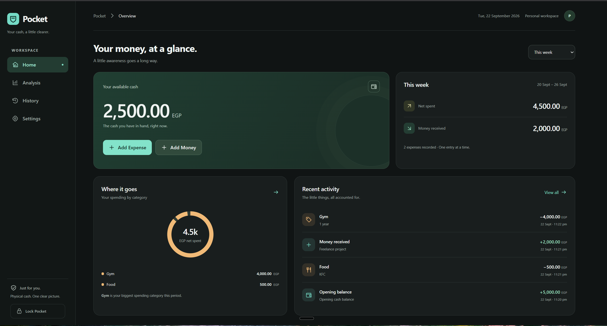
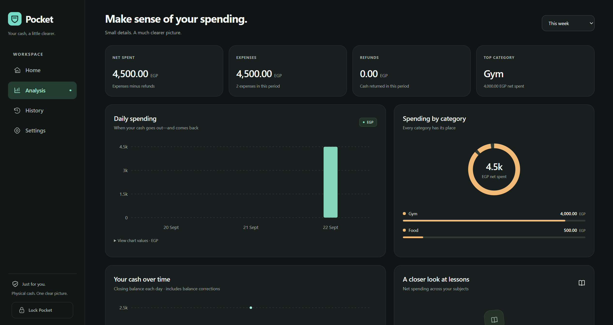
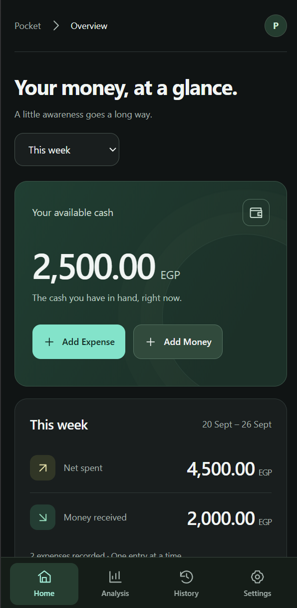

# Pocket — offline-first cash tracker

[](https://github.com/Mostafa-Atlas/pocket-cash-tracker/actions/workflows/ci.yml)


A private physical-cash tracker for PC and mobile. Works in your currency, Cairo time, Sunday-first weeks. Runs locally with **zero npm dependencies** — just Node.js + SQLite + vanilla HTML/CSS/JS.

> **Portfolio note:** I built this to track real cash reliably offline, with correct money math, safe concurrent edits, and restorable backups. No frameworks, no cloud, no tracking.

## Screenshots

Sample data from the disposable preview database.





See [docs/SCREENSHOTS.md](docs/SCREENSHOTS.md) for how I captured them with the disposable preview database.

## Features

- Cash in hand, Add Expense / Add Money, period summary, categories, recent activity
- Choose your currency at first launch (EGP, USD, EUR, GBP, SAR, AED + more); change the label later in Settings
- Analysis: net spent, refunds, largest category, category breakdown, daily spending, balance over time, lesson subjects
- History: search + filters (date, category, subject, type), edit / delete / refund with revision-conflict protection
- Corrections preserve original timestamps; balance corrections are visible adjustments excluded from spending totals
- Refunds link to an expense, can be partial, never exceed the expense; counted on return date
- Categories / lesson subjects: add, rename, archive, delete-only-when-unused
- PIN auth (salted scrypt hash), 24h HttpOnly SameSite sessions, rate-limited login, same-origin + custom-header mutation guard
- Backups: automatic weekly (keep 8), manual snapshots, download/upload JSON, checksum-validated restore with pre-restore recovery copy
- PWA-ready, mobile bottom tabs + bottom-sheet expense form, desktop sidebar + dialog, keyboard + reduced-motion + touch friendly

## Tech stack

- **Runtime:** Node.js 24+ (uses built-in `node:http`, `node:sqlite`, `node:crypto`, `node:test` — that's why Node 24 is required)
- **Frontend:** plain HTML / CSS / JavaScript + inline SVG charts, no CDN, no frameworks
- **Storage:** SQLite locally (`data/pocket.sqlite`), money as integer piastres, atomic mutations, chronological non-negative ledger validation
- **Tests:** `node --test` — 25 tests for ledger math, refunds, auth, HTTP, concurrency, backup/restore, persistence

## Architecture

```text
browser (vanilla JS + SVG)
   │  same-origin JSON, x-pocket-request: 1, session cookie
   ▼
server.mjs (built-in http, CSP + host allowlist + Tailscale bind)
   │  lib/store.mjs (SQLite persistence, sessions, backups)
   │  lib/ledger.mjs (pure money rules: balance, analytics, history)
   ▼
data/pocket.sqlite (ignored by git) + backups/*.json (ignored by git)
```

Key decisions:
- Integer piastres everywhere — no float rounding (covered by a dedicated test with many decimal expenses).
- Server is source of truth; no offline queue that lies about saving.
- Cairo (`Africa/Cairo`) boundaries, Sunday-first weeks.
- Listens on loopback + detected Tailscale IPv4 only, never LAN/WAN by default.

## Quickstart

Requirements: **Node.js 24+**, Git. Optional: Tailscale on both devices for phone access.

```powershell
git clone https://github.com/Mostafa-Atlas/pocket-cash-tracker.git
cd pocket-cash-tracker
node --version
node scripts/set-pin.mjs
node server.mjs
```

Visit http://127.0.0.1:4310, enter your PIN, choose your currency and set your opening cash. That's it — no `npm install`.

| Command | Purpose |
| --- | --- |
| `node server.mjs` / `npm start` | run production server |
| `node scripts/set-pin.mjs` / `npm run set-pin` | create / recover PIN (invalidates sessions) |
| `node --test tests/*.test.mjs` / `npm test` | run 25 isolated temp-DB tests |
| `npm run check` | JS syntax checks |
| `node scripts/ui-preview.mjs` / `npm run preview` | disposable browser-testing app on :4311 with test PIN `24682468` |

## Requirements

- **Node.js 24 or newer**, available in your terminal as `node`. Needed for the built-in `node:sqlite` module — no dependencies to install.
- **Git** to clone the repository (or download and extract its ZIP from GitHub).
- **Tailscale on both devices**, signed into the same Tailnet, for phone access.

There are no third-party npm dependencies. **You do not need to run `npm install`.** All fonts, styles, scripts, and icons are served locally. Use `nvm use` / `fnm use` with the included `.nvmrc` if you use a version manager.

## First-time setup

Open PowerShell or a terminal and run:

```powershell
git clone https://github.com/Mostafa-Atlas/pocket-cash-tracker.git
cd pocket-cash-tracker
node --version
node scripts/set-pin.mjs
```

Choose a PIN containing **4–12 digits** and enter it twice. Do this privately: digits are visible in this terminal. A fresh clone has **no default PIN, cash balance, or transactions**. Setup creates the local SQLite database and stores a salted PIN hash; your PIN is never added to the source code.

Then start Pocket:

```powershell
node server.mjs
```

Keep the terminal open. Visit [Pocket on this PC](http://127.0.0.1:4310), enter your PIN, choose your currency, and set the physical cash you currently have as your opening balance. Each unlocked browser is remembered for 24 hours.

**Already set up on this PC?** Skip the clone and PIN-setup steps. Run `node server.mjs` from the existing project folder.

## Everyday start and stop

On Windows, double-click **[start-pocket.cmd](start-pocket.cmd)**. On macOS/Linux, run `./start-pocket.sh` (first time: `chmod +x start-pocket.sh`). Alternatively, run `node server.mjs` from the project directory. `npm start` is an equivalent option when npm is working.

Press **Ctrl+C** in the server terminal to stop Pocket. Your saved records remain on disk. Launch it again when you need it; the app does not register itself to start with Windows.

## Access from your phone

1. Connect your PC and phone to the same Tailnet.
2. Start Tailscale on the PC **before** starting Pocket.
3. Start Pocket and look for the additional `http://...:4310` address printed in the terminal alongside the loopback address.
4. Open that **PC Tailnet address** in your phone's browser and enter your PIN. Do not use `127.0.0.1` on the phone; that refers to the phone itself.

The PC must stay awake and the server must stay running. By default, Pocket listens only on loopback and the detected Tailscale IPv4 interface; it does not expose the app on Wi-Fi/LAN or publish it to the internet. If Tailscale connects after Pocket starts, restart Pocket to detect it.

## Use

Home gives you cash in hand, Add Expense, Add Money, a period summary, categories, and recent activity. Analysis contains the full set of graphs. History supports search and filters; open a record to edit, delete, or refund it. Settings manages categories/subjects, balance corrections, lock, and backups.

Expense/income/refund corrections preserve their original timestamps. Balance corrections create new visible adjustments. An operation that would create a negative balance anywhere in the ledger is rejected. Remove dependent refunds before deleting their expense. Refunds count on the date returned, so a period can have negative net spending if it contains refunds for older purchases. Category and subject labels follow renames; archived items retain their historical association.

No offline transaction queue is included: a disconnected phone shows an error and does not claim the entry was saved. The server remains the source of truth. Revision checks prevent simultaneous browser edits from overwriting one another. Return to a page or refresh to fetch the latest data; switching back to the browser also checks for changes.

## Backups and restore

Live data is in `data/pocket.sqlite` (with SQLite WAL companions while running). This contains your ledger, salted PIN hash, and hashed session tokens. Keep it private.

Portable JSON snapshots are in `backups/`. Automatic snapshots run every seven days, starting with the first server launch. The latest eight weekly snapshots are retained. An overdue backup runs on the next launch. Manual and pre-restore recovery snapshots are retained separately.

Use Settings → Create manual backup → Download to save a copy elsewhere. Backups in the same PC/folder are useful for restoring edits; a downloaded copy on another device also survives PC loss. Backups contain financial data, not the PIN or sessions.

To restore, choose a saved snapshot or upload a downloaded JSON file in Settings, then type RESTORE. The file checksum and complete ledger are validated before anything changes. A recovery snapshot is written before replacing data. The PIN stays unchanged.

The `data/`, `backups/`, `.test-data/`, and `artifacts/` directories are ignored by Git. They are not included when you clone the repository. Never commit your live database, downloaded financial backups, or credentials.

## Optional configuration

Set environment variables before starting the server:

| Variable | Default | Purpose |
| --- | --- | --- |
| `PORT` | `4310` | Change the listening port. |
| `POCKET_DATA_DIR` | Project's `data/` folder | Local database location. |
| `POCKET_BACKUP_DIR` | Project's `backups/` folder | Portable backup location. |

For example, to use another port in PowerShell:

```powershell
$env:PORT = "4312"
node server.mjs
```

Use the matching port in your browser. Environment changes apply to that terminal session. Stop the server before changing storage paths. Use absolute paths for custom storage locations, keep them outside Git, and set the same variables when running the PIN setup command. Changing a path does not move existing data automatically.

## PIN recovery

Run `node scripts/set-pin.mjs` (or `npm run set-pin`) on the PC to choose a new PIN. This local recovery command invalidates all remembered sessions. Enter it privately because this terminal command displays typed digits. Stop/restart Pocket when setting the first PIN on a fresh installation.

## Development and verification

- `node --test tests/ledger.test.mjs tests/server.test.mjs` (or `npm test`): isolated temporary-database tests for ledger, dates, authentication, HTTP, concurrent edits, backup/restore, and persistence.
- `npm run check`: JavaScript syntax checks.
- `npm run preview`: disposable browser-testing app on http://127.0.0.1:4311 with test PIN `24682468`, isolated `.test-data/`, never touches production.

Implementation uses Node's built-in HTTP, SQLite, crypto, and test modules, with plain HTML/CSS/JavaScript and SVG. The SQLite module may print an experimental-feature warning in Node 24; it does not prevent startup. Everything needed by the frontend is local, without CDN or font downloads.

Physical phone connectivity requires verification from the phone. Windows/Tailnet policy can still block access even when the PC's own Tailnet address responds; no firewall or Tailnet policy is changed automatically.

## Roadmap

- [ ] Screenshots + demo GIF in README
- [ ] CSV export / import
- [ ] Monthly budget targets with progress bar
- [ ] Light theme toggle
- [ ] Docker image for one-command self-host

Contributions welcome — open an issue first to discuss scope. No external services or tracking will be accepted.

## Troubleshooting

| Problem | What to check |
| --- | --- |
| `node` is not recognized | Install Node.js 24 or newer and reopen the terminal. |
| Error mentioning `node:sqlite` | Check `node --version`; older Node versions are unsupported. |
| Pocket asks you to set a PIN first | Run `node scripts/set-pin.mjs`, then restart the server. |
| `npm` reports a missing `npm-cli.js` | Use the direct `node` commands above; Pocket does not need npm to run. |
| `EADDRINUSE` / address already in use | Pocket or another app already uses that port. Use the running instance, stop the conflicting process, or choose another `PORT`. |
| Phone cannot connect | Check that the PC is awake, the server is running, both devices are connected to the Tailnet, and you used the PC's Tailnet address. Then check Windows Firewall and Tailnet access policy for the chosen port. |
| Data changed on another screen | Refresh to get the latest records before retrying the correction. |
| Automatic backup failed | Check free disk space and write permission for the backup directory. |

## License

MIT — see [LICENSE](LICENSE).
